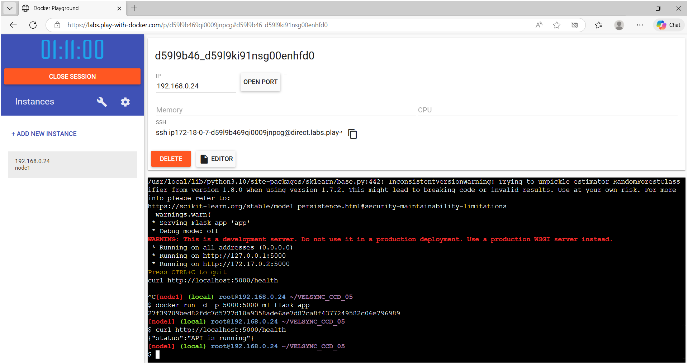
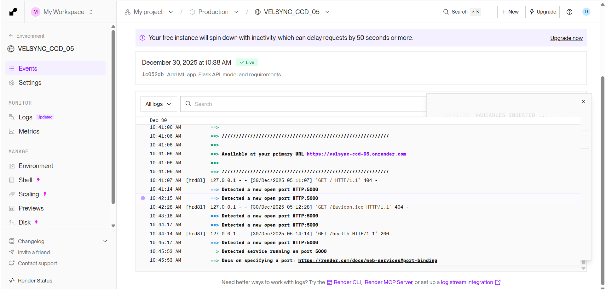
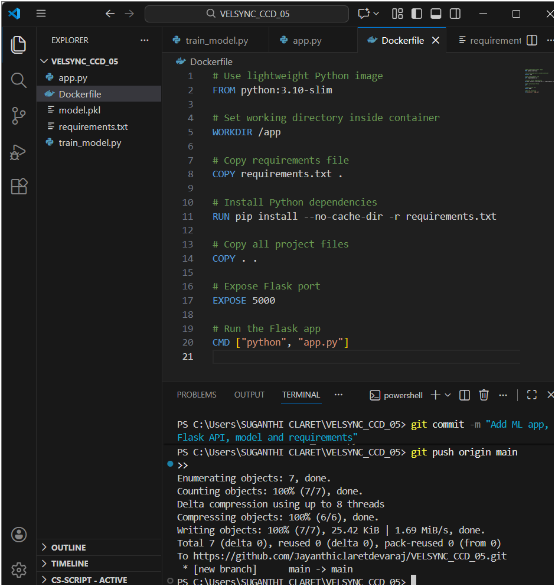

# 🚀 End-to-End Cloud Deployment of ML App (Task-05)

This project demonstrates a complete **end-to-end machine learning deployment workflow**, starting from model training to cloud deployment using **Docker and CI/CD**.

The application trains a simple ML model, exposes predictions via a **Flask REST API**, containerizes the app using **Docker**, and deploys it to the cloud using **Render** with **automatic redeployment on GitHub updates**.

---

## 📌 Project Flow

```
Data → ML Model → Flask API → Docker Container → Cloud (Render) → CI/CD
```

---

## 🧠 Tech Stack Used

- Python  
- scikit-learn  
- Flask  
- Docker  
- GitHub  
- Render (Cloud Deployment)  
- Play with Docker (Docker validation)  

---

## 📂 Project Structure

```
VELSYNC_CCD_05/
│
├── app.py              # Flask API
├── train_model.py      # ML model training script
├── model.pkl           # Trained ML model
├── requirements.txt    # Python dependencies
├── Dockerfile          # Docker configuration
└── README.md           # Project documentation
```

---

## ⚙️ ML Model Details

- **Dataset**: Iris Dataset (scikit-learn)
- **Algorithm**: RandomForestClassifier
- **Purpose**: Classify iris flower species based on input features

---

## 🌐 API Endpoints

### 🔹 Health Check
```
GET /health
```

**Response:**
```json
{
  "status": "API is running"
}
```

---

### 🔹 Prediction Endpoint
```
POST /predict
```

**Request Body:**
```json
{
  "features": [5.1, 3.5, 1.4, 0.2]
}
```

**Response:**
```json
{
  "prediction": 0
}
```

---

## 🐳 Dockerization

- The Flask ML application is containerized using Docker
- Dockerfile handles dependency installation and app execution
- Container exposes port **5000**

---

## ☁️ Cloud Deployment (Render)

- Dockerized application deployed to **Render**
- Render builds Docker image directly from GitHub repository
- **CI/CD enabled**: Any push to GitHub triggers auto-redeployment

🔗 **Live Application URL**
```
https://velsync-ccd-05.onrender.com/health
```

---

## 📸 Screenshots

> Create a folder named `screenshots/` in the repository and add the following images.

### 1️⃣ Docker Container Running (Play with Docker)


### 2️⃣ Health Endpoint Tested Using curl


### 3️⃣ Render Deployment Logs (Service Live)


### 4️⃣ Live Cloud Health Check


---

## 🔁 CI/CD Workflow

1. Code pushed to GitHub  
2. Render detects repository changes  
3. Docker image rebuilt automatically  
4. Application redeployed without manual intervention  

---

## ✅ Final Outcome

✔ ML model trained  
✔ Flask API created  
✔ Docker container built  
✔ Docker validated using Play with Docker  
✔ Cloud deployment completed  
✔ Public live URL generated  
✔ CI/CD pipeline enabled  

---

## 📌 Conclusion

This project successfully demonstrates an **end-to-end ML cloud deployment pipeline**, integrating machine learning, backend development, containerization, and cloud DevOps practices.

It reflects real-world deployment workflows used in modern production environments.

---

## 👩‍💻 Author

**Clara**
